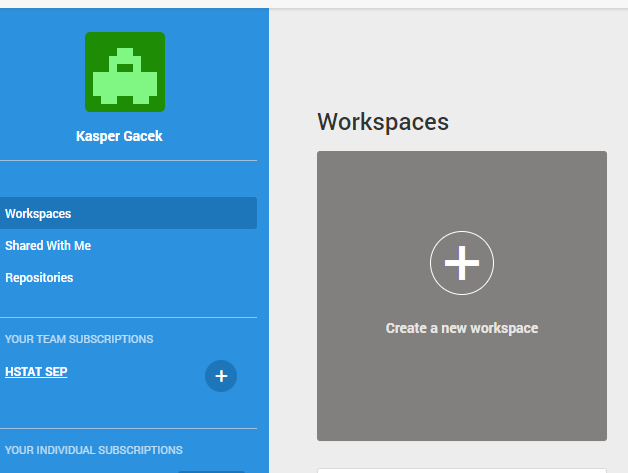
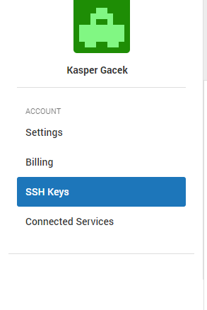

# GitHub Tutorial

**_by Kasper Gacek :)_**

---
## Git vs. GitHub
* Git is a command
    * example:` git init`
* Github is a repository where you have all your files and directory

---
## Initial Setup
* sign into github or create a new github account
* click on profile in the top right
* go to settings
* go to SSH and GPG keys tab
* 

<p align = "center">
  
</p>

1. to sign up to github enter info in the above and press the sign up button.

<p align = "center">
   
</p>
2. create a workspace by clicking the workspace option and fill in the info shown above.

<p align = "center">
   
</p>

3. create an ssh key by clicking settings >> ssh keys. Then copy the second piece of ssh keys. an example of it looks like this:

`ssh-rsa AAAABgitready2EAAAADAbuellerAQC7X4buellerU99Yev3hbHQTlDXaFC2uJsAD4R58Qo7IAtNv+KsyKspI5C/SwoCiK2UVkfTKtqPvCnA2tGMPAVeMayvihSeDLbadQ7pjhkRuOV3CjM0dTxAq2yA3Y1D0PY7EOnV0BeM9RjsZyr61QAeJEvdcC/o3vaJ8dmWdNvix39jUtk8BPEqwid0N1GH2YJFDpAR9Pg9glJt13fzHdZrHiKHT5VMGkURELeUdtvaHa0/sxV99QrOGIDMb1q5pmNbWRN50TWgvbluQmM5MJZAkxFopAJBqcl6owVGC52xaGZj5D2mqLmGIfUEtZ48Dfh/QpksG+UZk30dN8/y+LixbYFM1BHTOcfkv32gXhJHNQkXrdUBDT783rmGkl2I7mA7OSiZp8Ltpkvb5eW8rH8Jmg8Ji4FCJI2/b5+wigeELb66TD/0hFptxH6GM/6+kXVE9qc+2NF5AImtF1sD0Drz8yw6bqdhr1Tk+3GmfGiFSMeU7QM38TAjeSI6oxEDzf6i1k81CiI0TWZqOIYTm4C0v/DCd1iqz2rn0EIIuIhwlIaoa3q8pALDIT53+vzfwY3OZIhWsCOrbSshwAo0upKIcsd/hisamaQOQxcyJytvpDtvIXksEbQC6JadLP7hCa/XFcoDlqpgs3TIhi+m87IoXH4sr4m22u7iU4o0MIyw== fbueller1986@GBNHS.org`

4. Your done


---
## Repository Setup
```html


kasperg3971:~/workspace/github-tutorial (master) $ git init
Reinitialized existing Git repository in /home/ubuntu/workspace/github-tutorial/.git/
kasperg3971:~/workspace/github-tutorial (master) $ git status
On branch master
Your branch is up-to-date with 'origin/master'.

Changes not staged for commit:
  (use "git add <file>..." to update what will be committed)
  (use "git checkout -- <file>..." to discard changes in working directory)

        modified:   README.md

no changes added to commit (use "git add" and/or "git commit -a")
kasperg3971:~/workspace/github-tutorial (master) $ git add .
kasperg3971:~/workspace/github-tutorial (master) $ git status
On branch master
Your branch is up-to-date with 'origin/master'.

Changes to be committed:
  (use "git reset HEAD <file>..." to unstage)

        modified:   README.md
        
kasperg3971:~/workspace/github-tutorial (master) $ git commit -m "Tutorial complete"
[master f0b4ab2] Tutorial complete
 1 file changed, 5 insertions(+), 1 deletion(-)
 
 kasperg3971:~/workspace/github-tutorial (master) $ git push
Warning: Permanently added 'github.com,192.30.253.113' (RSA) to the list of known hosts.
Counting objects: 6, done.
Delta compression using up to 8 threads.
Compressing objects: 100% (6/6), done.
Writing objects: 100% (6/6), 1.20 KiB | 1.20 MiB/s, done.
Total 6 (delta 1), reused 0 (delta 0)
remote: Resolving deltas: 100% (1/1), done.
To github.com:kasperg3971/github-tutorial.git
   e39e756..41b1018  master -> master
 

```
1. git init: initializes the code to get ready for the commit 
2. git status: checks if the files are green(changed, added files) or red (old,not changed, new)
3. git add . : adds the file to get ready for committing
4. git commit -m "": saves/screenshots the file with a saved message.
5. git push: adds the commit to the repository


---

## Workflow & Commands

* `mkdir` : creates a directory
*  `cd` : goes into the child directory or file within the current directory
*  `cd .. ` : goes back to previous directory or parent directory
*  ` ~` : returns to the root
*  `pwd` : lists the current specific directory all the way to its parents directory and root
*  `ls` : lists all the child directorys or files within the directory
*  `rmdir` : removes a empty directory
*  `touch` : creates a file
*  `rm` : removes a file
*  `rm -f`: removes directory by force
*  `mv`: can be used for two things, it can be used for moving things,ex:` mv file1.txt existingfile.txt`, or it could be used for renaming a file, ex: `mv file1.txt newnamefile.txt`
*  `/`: helps travel quicker to a child's child directory
*  `clear` : saves data but clears canvas
*  `(control C)` & ` (control D)`: Control c creates a new line for you to type on while control d puts the local host in front of the local host
*  `↑` : Goes to your previous commands
*  `git add --all` : adds all files new ones, old ones, and deleted ones
*  `git add origin URL` :  A command of making a connection between our two repositories  and adding a repo and have its origin and having a location
*  `git push -u origin master` : Sending commits into remote repo with a upstream to the main branch
*  `git log` : Shows a listing of commits on a branch including the corresponding details
*  `Git pull` :


---
## Rolling Back Changes
This section will explain the foundations of undoing git commands
* `git checkout -- filename` : undoes a edit
* `git reset HEAD filename` : undoes add
* `git reset --soft HEAD~1` : undoes a commit
* `git reset HEAD~1` : undoes the last commit and unstages the file
* `git reset --hard HEAD~1` : undoes a commit, unstages the file and deletes all the changes
* `git reset –hard HEAD~` : undoes a pushed commit
